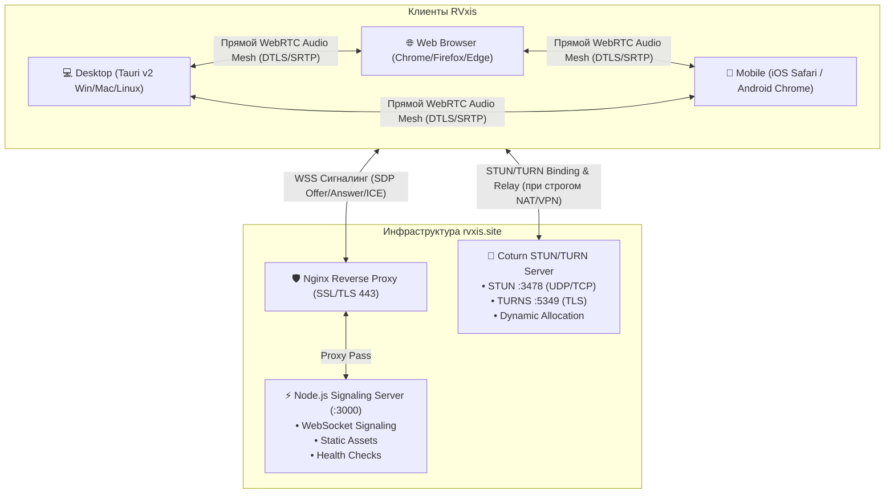
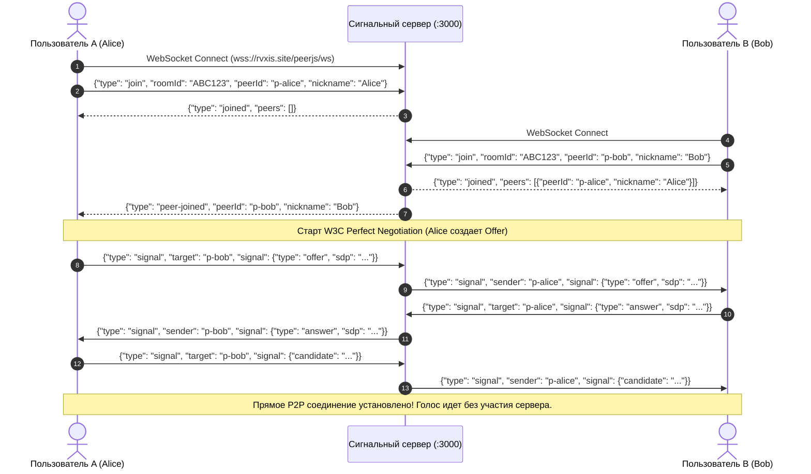
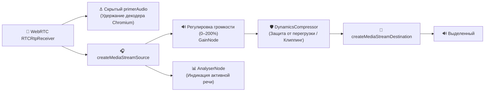
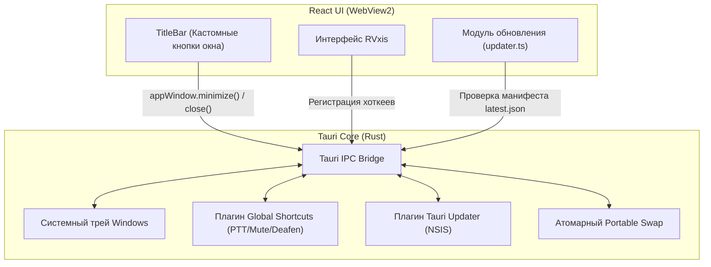

# 🏛️ Архитектурный манифест RVxis (ARCHITECTURE.md)

> **RVxis** — легковесное, защищенное, кроссплатформенное децентрализованное приложение для голосового и текстового общения в реальном времени. Работает как в любых современных веб-браузерах, так и в виде нативного настольного клиента Windows/macOS/Linux на базе Tauri v2.

---

## 1. Концепция и базовые принципы системы

1. **Децентрализованный Full-Mesh WebRTC**:
   - Аудиопотоки передаются напрямую между участниками (Peer-to-Peer) без промежуточной перекодировки на сервере (SFU/MCU не используются).
   - Минимальная задержка (15–50 мс), отсутствие задержек на буферизацию сервера.
2. **Абсолютная приватность (RAM-Only & Zero-Persistence)**:
   - Никаких баз данных, учетных записей или постоянных идентификаторов.
   - Текстовые сообщения живут только в оперативной памяти браузера/клиента и передаются через сквозные WebRTC DataChannels (с fallback через память сигнального сервера).
   - Сквозное шифрование медиапотоков DTLS-SRTP.
3. **Кристальный звук и студийный DSP**:
   - Двухуровневая система очистки: аппаратный фильтр микрофона + нейросетевая модель RNNoise в AudioWorklet.
   - Аналоговые спектральные фильтры (High-Pass 90 Гц, Presence EQ 3200 Гц, High-Cut 12 кГц).
   - Мягкий экспоненциальный нойз-гейт (Downward Expander) и режим Opus DTX для кристальной тишины в паузах.
4. **Устойчивость к строгим сетям и VPN**:
   - Автоматический обход Symmetric NAT через собственный сервер Coturn STUN/TURN (UDP, TCP, TURNS TLS на порту 5349).
   - Самовосстановление соединений (ICE Restart) при смене сетевых маршрутов без перезахода в комнату.
5. **Современный Glassmorphic UI**:
   - Глубокая темная эстетика Obsidian `#020617`, 7 анимированных сфер плазменного свечения, умные тултипы с защитой от вылета за границы экрана и нулевые рывки геометрии.

---

## 2. Общая топология системы



---

## 3. Структура кодовой базы

```
voice-chat-main/
├── src/                                  # Фронтенд (React 18 + TypeScript + Vite)
│   ├── components/                       # UI Компоненты приложения
│   │   ├── AudioDeviceSettings.tsx       # Модальное окно выбора микрофона/динамиков и настройки хоткеев
│   │   ├── ChatPanel.tsx                 # Текстовый чат комнаты в реальном времени (WebRTC DataChannel)
│   │   ├── LobbyScreen.tsx               # Стартовый экран создания и входа в комнату
│   │   ├── Modal.tsx                     # Базовый компонент стеклянного модального окна
│   │   ├── TitleBar.tsx                  # Кастомный заголовок окна для Desktop (Tauri)
│   │   ├── Tooltip.tsx                   # Портальные умные всплывающие подсказки с защитой от вылета
│   │   ├── UpdateModal.tsx               # Диалог проверки и установки обновлений
│   │   └── VoiceChatScreen.tsx           # Основной экран активной комнаты (десктопный и мобильный вид)
│   ├── hooks/                            # Кастомные React-хуки бизнес-логики
│   │   ├── useAudioDevices.ts            # Управление аудиоустройствами, тестирование микрофона
│   │   ├── useHotkeys.ts                 # Обработка локальных и глобальных шорткатов (PTT, Mute, Deafen)
│   │   └── useVoiceChat.ts               # Ядро WebRTC P2P Mesh, аудиографа и сигнального обмена
│   ├── utils/                            # Вспомогательные утилиты
│   │   ├── device.ts                     # Детекция смартфонов/планшетов/десктопа
│   │   ├── nicknames.ts                  # Генератор читаемых никнеймов и 6-символьных room ID
│   │   ├── soundEffects.ts               # Синтез звуковых сигналов (mute, unmute, deafen, join, leave)
│   │   └── updater.ts                    # Логика Tauri v2 Updater и атомарного Portable .exe swap
│   ├── App.tsx                           # Корневой координатор состояния и маршрутизации
│   ├── config.ts                         # Конфигурация приложения, версия и fallback ICE-серверы
│   ├── index.css                         # Стили Tailwind CSS v4, ключевые кадры анимаций, 7 сфер плазмы
│   └── main.tsx                          # Точка входа React
│
├── src-tauri/                            # Настольный клиент Tauri v2 (Rust)
│   ├── src/
│   │   ├── lib.rs                        # Точка входа Rust, настройка плагинов, системного трея и команд
│   │   └── main.rs                       # Запуск нативного приложения
│   ├── Cargo.toml                        # Зависимости Rust (tauri v2, updater, global-shortcut)
│   └── tauri.conf.json                   # Конфигурация окна, бандлера, идентификатора и прав доступа
│
├── server/                               # Бэкенд сигналинга (Node.js + Express + ws)
│   └── index.js                          # Сигнальный сервер, валидация пакетов, rate limiting, healthcheck
│
├── scripts/                              # Утилиты автоматизации и тестирования
│   ├── bump-version.js                   # Автоматическая синхронизация версий во всех конфигах проекта
│   ├── generate-latest-json.js           # Формирование релизного манифеста latest.json с Ed25519 подписью
│   ├── test-multi-user-mesh.js           # Комплексный стресс-тест P2P Mesh на 7 одновременных участников
│   └── unit-tests.js                     # Модульные тесты логики приложения
│
├── public/                               # Статические ресурсы
│   ├── rnnoise/                          # WebAssembly модуль RNNoise для подавления шумов
│   ├── workletProcessor.js               # AudioWorklet процессор для потоковой нейросетевой фильтрации
│   └── health                            # Статический fallback-манифест проверки здоровья
│
├── Dockerfile                            # Многоэтапная сборка контейнера (Node 20 Alpine)
├── docker-compose.yml                    # Спецификация для оркестрации на VPS
└── package.json                          # Зависимости и скрипты проекта
```

---

## 4. Сигнальный протокол и WebSocket-сервер

Сигнальный сервер (`server/index.js`) выполняет исключительно роль брокера начального рукопожатия WebRTC (SDP Offer/Answer и ICE Candidates) и мониторинга присутствия.

### 4.1 Жизненный цикл подключения


### 4.2 Спецификация сообщений протокола

| Тип сообщения | Направление | Полезная нагрузка | Описание |
| :--- | :--- | :--- | :--- |
| `join` | Клиент $\to$ Сервер | `{ roomId, peerId, nickname, isMuted, isDeafened }` | Запрос на вход в комнату |
| `joined` | Сервер $\to$ Клиент | `{ roomId, yourId, peers: [...] }` | Подтверждение входа со списком активных участников |
| `peer-joined` | Сервер $\to$ Клиенты | `{ peerId, nickname, isMuted, isDeafened }` | Оповещение о подключении нового участника |
| `signal` | Двунаправленный | `{ target, sender, signal: (offer\|answer\|candidate) }` | Маршрутизация WebRTC SDP и ICE |
| `speaking` | Двунаправленный | `{ isSpeaking: boolean }` | Оповещение об активности голоса (фильтруется diff-ом) |
| `mute` / `deafen` | Двунаправленный | `{ isMuted: boolean, isDeafened: boolean }` | Синхронизация статуса заглушения |
| `reconnect` | Двунаправленный | `{ target, sender, reconnect: true }` | Координированный запрос на перестроение P2P |
| `peer-left` | Сервер $\to$ Клиенты | `{ peerId }` | Уведомление об отключении участника |
| `ping` / `pong` | Двунаправленный | `{}` | Heartbeat каждые 15 сек для предотвращения разрыва сокетов |

### 4.3 Защита сервера и отказоустойчивость
- **Защита от флуда (Rate Limiting)**: строгий лимит 25 сообщений в секунду на каждый сокет. При превышении сокет принудительно разрывается с кодом `4029`.
- **Защита памяти от Out Of Memory**: максимальный размер входящего WebSocket-фрейма ограничен `maxPayload: 64 * 1024` (64 КБ).
- **Контроль обратного давления (Backpressure)**: если буфер отправки сокета превышает `512 КБ`, низкоприоритетные пакеты отбрасываются.
- **Вытеснение зависших сокетов (Ghost Socket Eviction)**: при повторном входе пира с тем же ID старый зависший сокет мгновенно закрывается, исключая дублирование карточек в комнате.

---

## 5. WebRTC P2P Mesh и Coturn TURN

### 5.1 Топология Full Mesh
Для обеспечения максимальной конфиденциальности и минимального пинга используется полная топология $N \times (N - 1) / 2$ соединений:
- 2 участника: 1 P2P канал
- 4 участника: 6 P2P каналов
- 8 участников: 28 P2P каналов

Благодаря жесткому ограничению битрейта Opus до 32 кбит/с и включению Opus DTX, 8 активных участников создают суммарный исходящий трафик всего около 220 кбит/с, что легко выдерживает любое домашнее или мобильное интернет-подключение.

### 5.2 W3C Perfect Negotiation
Для предотвращения коллизий одновременных офферов (`InvalidStateError` / Glare) внедрен стандарт **W3C Perfect Negotiation**:
- Участники делятся на **Polite** (вежливый) и **Impolite** (невежливый) на основе детерминированного лексикографического сравнения Peer ID (`myPeerId > remotePeerId`).
- При встречном оффере «вежливый» участник автоматически откатывает локальное описание (`await pc.setLocalDescription({ type: 'rollback' })`) и принимает оффер собеседника, исключая зависание соединения.

### 5.3 Инфраструктура Coturn
Для гарантированной связи в условиях строгого корпоративного файрвола, мобильных операторов с CGNAT или активных VPN развернут собственный узел Coturn:
- **STUN**: порт `3478` (UDP/TCP) для быстрого определения внешнего рефлексивного адреса.
- **TURNS**: порт `5349` (TLS) — весь трафик маскируется под стандартный HTTPS/TLS, предотвращая блокировку провайдерами с глубоким анализом пакетов (DPI).
- **Резервные узлы**: публичные STUN-серверы Google и Twilio прописаны в качестве резервных.

---

## 6. Звуковой тракт и DSP-пайплайн (Web Audio API)

Звуковой тракт RVxis спроектирован для достижения студийного качества голоса без фоновых шумов и эха.

### 6.1 Тракт захвата и отправки звука (Input DSP)

```mermaid
flowchart LR
    Mic["🎙️ Микрофон"] --> HW["🎛️ WebRTC Аппаратный Фильтр\n• noiseSuppression: true\n• echoCancellation: true\n• autoGainControl: false"]
    HW --> Ctx["🎵 AudioContext (48000 Гц)"]
    Ctx --> HPF["🔻 High-Pass Фильтр 90 Гц\n(Срез вибраций стола и ветра)"]
    HPF --> RN["🧠 RNNoise AudioWorklet WASM\n(Нейросетевое удаление шумов)"]
    RN --> EQ["📈 Peaking EQ 3200 Гц (+0.8 дБ)\n(Четкость и разборчивость речи)"]
    EQ --> HCF["🔺 High-Cut Фильтр 12000 Гц\n(Срез писка дросселей и свитчей)"]
    HCF --> Gate["🚪 Мягкий Нойз-Гейт (Downward Expander)\n• Attack: 10 мс\n• Hangover: 400 мс\n• Release: 50 мс"]
    Gate --> Opus["📦 Кодек Opus (usedtx=1, maxavgbitrate=32000)"]
    Opus --> Sender["📡 WebRTC RTCRtpSender (SRTP)"]
```



#### Ключевые параметры фильтрации:
1. **Синхронизация с 48 кГц**: `AudioContext` жестко фиксируется на частоте 48000 Гц, что исключает потерю качества при ресемплинге для RNNoise и кодека Opus.
2. **Экспоненциальный Downward Expander (Нойз-Гейт)**:
   - В отличие от резких пороговых гейтов, экспандер плавно уменьшает коэффициент усиления при падении уровня сигнала ниже порога тишины.
   - Окно удержания (Hangover) 400 мс гарантирует, что окончания фраз и затухания голоса никогда не обрезаются.
3. **Opus Discontinuous Transmission (DTX)**:
   - В SDP оффера прописывается флаг `usedtx=1`. Во время пауз аудиопакеты физически не передаются по сети, обеспечивая абсолютную тишину в наушниках собеседника и экономию трафика.

### 6.2 Тракт приема и воспроизведения (Single-Sink Output)



#### Решение проблемы двух устройств (Single-Sink Architecture):
- Прямое подключение Web Audio к `ctx.destination` **полностью исключено**, так как `ctx.destination` жестко привязан к системному аудиовыходу Windows по умолчанию.
- Весь обработанный поток направляется в виртуальное назначение `createMediaStreamDestination()`, которое затем передается в скрытый элемент `<audio>` с принудительным вызовом `setSinkId(audioOutputDeviceId)`. Это гарантирует 100% вывод звука строго в выбранные пользователем наушники.

---

## 7. Архитектура десктопного приложения (Tauri v2)

Настольная версия RVxis построена на базе фреймворка **Tauri v2** (Rust + WebView2 на Windows).



### 7.1 Двойной режим обновления (Dual Auto-Updater)
Приложение поддерживает два типа распространения под Windows:
1. **Установленная версия (NSIS Installer)**:
   - Обновление обрабатывается нативным плагином `@tauri-apps/plugin-updater`.
   - Загружается архив `.nsis.zip`, проверяется криптографическая подпись Ed25519 по открытому ключу в `tauri.conf.json`, и инсталлятор выполняет тихое обновление в директорию `AppData/Local/Programs/RVxis`.
2. **Портативная версия (Portable Mode)**:
   - Обнаруживается по отсутствию записей в реестре и исполнению из произвольной папки (`is_portable_mode`).
   - Приложение скачивает свежий `RVxis.exe` во временный файл `RVxis.exe.new`.
   - Запускается отсоединенный процесс PowerShell, который дожидается завершения текущего процесса, атомарно переименовывает старый файл в `.old`, подставляет новый исполняемый файл и перезапускает приложение.

---

## 8. Дизайн-система (Glassmorphism Dark)

Интерфейс RVxis спроектирован по канонам современного интерфейсного дизайна с акцентом на высокую информативность и отсутствие визуального шума.

### Цветовая палитра и токены:
- **Базовый фон приложения**: `#020617` (Tailwind `slate-950`).
- **Стеклянные несущие панели**: `bg-slate-950/45 backdrop-blur-xl border border-white/10 rounded-2xl shadow-2xl shadow-black/40`.
- **Интерактивные карточки**: `bg-black/30 hover:bg-black/40 border border-white/10 hover:border-white/20 rounded-xl`.
- **Индикация собственной карточки («Вы»)**: тонкая акцентная окантовка `border-blue-500/30 hover:border-blue-500/45`.
- **Индикация активной речи**: мягкое изумрудное свечение `border-green-500/50 bg-green-500/[0.06] shadow-sm shadow-green-500/20`.

### Система органического фона (7 Spheres Jelly):
Фон состоит из 7 независимых цветных сфер, плавно перетекающих с использованием `mix-blend-mode: screen` и размытия `filter: blur(80px)`:
1. Синий сапфир (`#1e3a8a` $\to$ `#1e40af`)
2. Тёмно-синий океан (`#172554` $\to$ `#1e3a5f`)
3. Глубокий индиго (`#312e81` $\to$ `#1e1b4b`)
4. Морской циан (`#164e63` $\to$ `#155e75`)
5. Полуночный ультрамарин (`#1e1e38` $\to$ `#25254d`)
6. Лазурный аквамарин (`#0e3a47` $\to$ `#104757`)
7. Глубокий кобальт (`#1b2a47` $\to$ `#1f3459`)

---

## 9. Развертывание и эксплуатация на VPS

### 9.1 Системные требования к серверу
- **ОС**: Ubuntu 20.04 LTS или новее
- **Ресурсы**: 1 CPU, 1 ГБ RAM, 10 ГБ SSD
- **Порты**:
  - `80/TCP`, `443/TCP` — веб-трафик и WebSocket (Nginx / SSL)
  - `3478/UDP`, `3478/TCP` — Coturn STUN
  - `5349/UDP`, `5349/TCP` — Coturn TURNS (TLS)
  - `49152-65535/UDP` — диапазон портов ретрансляции WebRTC Coturn

### 9.2 Конфигурация Nginx
```nginx
server {
    listen 80;
    server_name rvxis.site;
    return 301 https://$host$request_uri;
}

server {
    listen 443 ssl http2;
    server_name rvxis.site;

    ssl_certificate /etc/letsencrypt/live/rvxis.site/fullchain.pem;
    ssl_certificate_key /etc/letsencrypt/live/rvxis.site/privkey.pem;

    # Раздача обновлений десктопного клиента
    location /downloads/ {
        alias /var/www/rvxis/downloads/;
        add_header Cache-Control "no-cache";
        add_header Access-Control-Allow-Origin "*";
    }

    # Статический манифест обновлений
    location = /api/updater/latest.json {
        alias /var/www/rvxis/downloads/latest.json;
        add_header Cache-Control "no-cache";
        add_header Access-Control-Allow-Origin "*";
    }

    # Проксирование приложения и WebSocket сигналинга
    location / {
        proxy_pass http://127.0.0.1:3000;
        proxy_http_version 1.1;
        proxy_set_header Upgrade $http_upgrade;
        proxy_set_header Connection "upgrade";
        proxy_set_header Host $host;
        proxy_set_header X-Real-IP $remote_addr;
        proxy_set_header X-Forwarded-For $proxy_add_x_forwarded_for;
        proxy_set_header X-Forwarded-Proto $scheme;
        proxy_read_timeout 86400s;
        proxy_send_timeout 86400s;
    }
}
```

### 9.3 Конфигурация Coturn (`/etc/turnserver.conf`)
```ini
listening-port=3478
tls-listening-port=5349
listening-ip=0.0.0.0
relay-ip=ВАШ_ВНЕШНИЙ_IP
external-ip=ВАШ_ВНЕШНИЙ_IP
realm=rvxis.site
fingerprint
lt-cred-mech
user=voicechat:VoiceChat2026SecureTurnPassword!
cert=/etc/letsencrypt/live/rvxis.site/fullchain.pem
pkey=/etc/letsencrypt/live/rvxis.site/privkey.pem
min-port=49152
max-port=65535
verbose
```

---

## 10. Разработка, тестирование и релизный пайплайн

### 10.1 Команды разработчика
```bash
# Запуск фронтенда в режиме быстрой разработки (Vite HMR)
npm run dev

# Проверка типов TypeScript (без сборки)
npm run typecheck

# Запуск модульных тестов
npm test

# Запуск стресс-тестирования P2P Mesh (7 участников)
node scripts/test-multi-user-mesh.js

# Сборка веб-версии в dist/
npm run build

# Локальный запуск продакшн сервера
npm start

# Запуск десктопного приложения в режиме разработки
npm run desktop:dev

# Сборка релизного инсталлятора и исполняемого файла Tauri
npm run desktop:build
```

### 10.2 Релизный пайплайн
Для выпуска новой версии используется автоматизированный скрипт:
```bash
node scripts/bump-version.js 0.0.53 --push
```
Скрипт автоматически:
1. Обновляет версию в `package.json`, `package-lock.json`, `src-tauri/tauri.conf.json`, `src-tauri/Cargo.toml`, `src/config.ts`, `server/index.js`, `public/health`.
2. Добавляет шаблон новой версии в начало `HISTORY.md`.
3. Создает git-коммит и тег `v0.0.53`.
4. Пушит изменения на GitHub, активируя CI/CD GitHub Actions для сборки кроссплатформенных релизов и генерации `latest.json` с Ed25519 подписью.

---

*Архитектурный манифест актуален для версии RVxis 0.0.52.*
