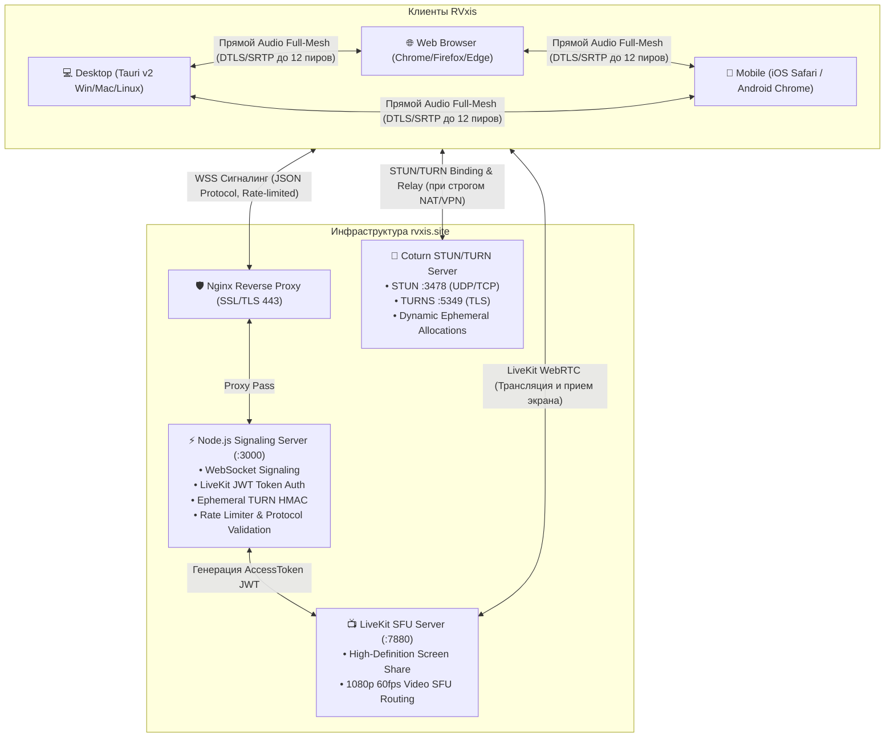
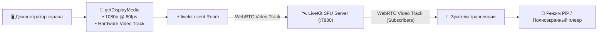
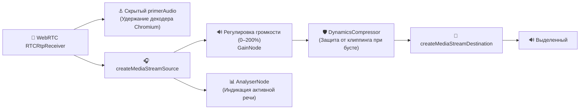
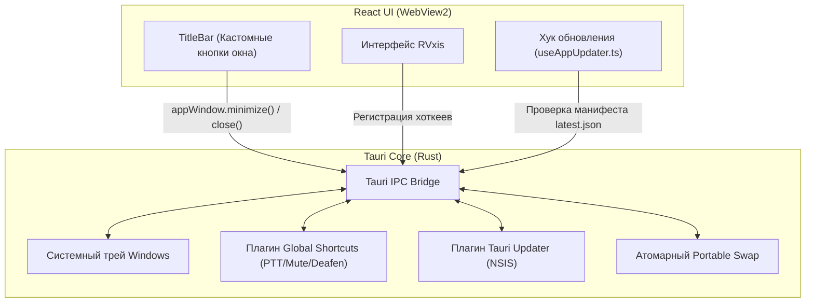

# 🏛️ Архитектурный манифест RVxis (ARCHITECTURE.md)

> **RVxis** — легковесное, защищенное, кроссплатформенное приложение для голосового, текстового общения и демонстрации экрана в реальном времени. Работает как в современных веб-браузерах (Desktop & Mobile), так и в виде нативного настольного клиента Windows/macOS/Linux на базе Tauri v2.

---

## 1. Концепция и базовые принципы системы

1. **Гибридная архитектура WebRTC (P2P Audio Mesh + SFU Screen Share)**:
   - **Голос (P2P Full-Mesh)**: Аудиопотоки передаются напрямую между клиентами без промежуточной перекодировки на сервере для комнат до 12 участников. Минимальная задержка (15–50 мс), отсутствие нагрузки на серверное CPU при обработке медиа.
   - **Экран (LiveKit SFU)**: Видеопоток демонстрации экрана передается через специализированный SFU-сервер LiveKit (1080p 60fps), что гарантирует высокую плавность без квадратов и просадок FPS даже при слабом канале у зрителей.
2. **Абсолютная приватность (RAM-Only & Zero-Persistence)**:
   - Никаких постоянных аккаунтов, номеров телефонов или баз данных пользователей.
   - Комнаты создаются на лету по 6-значному коду.
   - Текстовый чат и метаданные существуют исключительно в оперативной памяти и очищаются сразу после выхода последнего участника.
   - Сквозное шифрование медиапотоков DTLS-SRTP.
3. **Кристальный звук и студийный DSP**:
   - Двухуровневая система очистки: аппаратный фильтр микрофона + нейросетевая модель **RNNoise** в AudioWorklet (WebAssembly).
   - Аналоговые спектральные фильтры (High-Pass 90 Гц, Presence EQ 3200 Гц, High-Cut 12 кГц).
   - Мягкий экспоненциальный нойз-гейт (Downward Expander) и режим Opus DTX (`usedtx=1`) для абсолютной тишины в паузах.
4. **Предсказуемое масштабирование комнат (Лимит MAX_ROOM_PEERS = 12)**:
   - Жесткая фиксация предела P2P Full-Mesh сети: не более 12 участников в одной комнате (66 P2P-соединений).
   - Протокольное отклонение 13-го участника с кодом `room_full` для защиты пользователей от сетевой перегрузки и троттлинга аудиодекодеров.
   - Бесшовное переподключение (Ghost Socket Eviction) при сетевых сбоях.
5. **Изоляция персональных настроек**:
   - Громкость каждого собеседника привязана строго к `peerId` (`peer_volume_id_${peerId}`) и диапазону 0–200%.
   - Смена никнейма собеседником не сбрасывает и не перезаписывает пользовательские настройки звука.
6. **Устойчивость к строгим сетям и VPN**:
   - Автоматический обход Symmetric NAT через собственный сервер Coturn STUN/TURN (UDP, TCP, TURNS TLS на порту 5349).
   - Поддержка динамических эфемерных учетных данных TURN на базе HMAC-SHA1 (`COTURN_SHARED_SECRET`).
   - Автоматическое самовосстановление (ICE Restart) при смене сетевых интерфейсов.
7. **Современный Glassmorphic UI**:
   - Глубокая темная эстетика Obsidian `#020617`, 7 анимированных сфер плазменного свечения, умные портальные тултипы и стабильная верстка без скачков геометрии.

---

## 2. Общая топология системы



---

## 3. Модульная структура кодовой базы

Проект полностью рефакторизован по принципам модульности, высокой связности (high cohesion) и слабой зацепленности (loose coupling). Крупные монолитные модули разделены на специализированные хуки и UI-субкомпоненты.

```
voice-chat-main/
├── src/                                  # Фронтенд (React 18 + TypeScript + Vite)
│   ├── components/                       # Базовые UI-компоненты
│   │   ├── voice/                        # Декомпозированные модули экрана голосового чата
│   │   │   ├── VoiceCapacityBadge.tsx    # Индикатор емкости комнаты (N/12) и Mesh P2P статуса
│   │   │   ├── VoicePeerCard.tsx         # Мемоизированная карточка собеседника (слайдер 0-200%, стрим)
│   │   │   ├── VoiceSelfCard.tsx         # Карточка локального пользователя с инлайн-сменой ника
│   │   │   ├── VoiceEmptySlot.tsx        # Состояние комнаты в одиночестве с кнопкой инвайта
│   │   │   ├── VoiceSidebar.tsx          # Десктопная боковая панель участников и управления
│   │   │   ├── VoiceMobileHeader.tsx     # Мобильный компактный заголовок с бейджем заполненности
│   │   │   ├── VoiceMobileParticipants.tsx # Горизонтальная лента аватаров для смартфонов
│   │   │   ├── VoiceMobileControls.tsx   # Мобильная панель быстрых действий (Mic, Deafen, Share)
│   │   │   ├── VoiceConnectionBanner.tsx # Анимированный баннер состояния связи и ошибки room_full
│   │   │   ├── VoiceSharePanel.tsx       # Панель демонстрации ссылки и QR-приглашения
│   │   │   ├── VoiceSettingsModal.tsx    # Модальное окно аудиоустройств и хоткеев
│   │   │   ├── MobilePeerVolumeModal.tsx # Мобильная шторка регулировки громкости выбранного пира
│   │   │   ├── MobileNicknameModal.tsx   # Мобильный диалог изменения никнейма
│   │   │   └── voiceUtils.ts             # Утилиты инициалов и детерминированных градиентов
│   │   ├── AudioDeviceSettings.tsx       # Настройки аудиоустройств и горячих клавиш
│   │   ├── ChatPanel.tsx                 # Текстовый чат комнаты в реальном времени
│   │   ├── ChunkErrorBoundary.tsx        # Защита от белого экрана (Error Boundary) и Suspense Fallback
│   │   ├── JellyBackground.tsx           # Анимированные сферы органического плазменного свечения
│   │   ├── LobbyScreen.tsx               # Экран создания комнаты и ввода 6-значного кода
│   │   ├── Modal.tsx                     # Базовый компонент стеклянного модального окна
│   │   ├── updater/                      # Декомпозированные модули диалога обновления
│   │   │   ├── UpdateBadge.tsx           # Символьная кнопка обновления (emerald) в TitleBar и настройках
│   │   │   ├── UpdateModalHeader.tsx     # Заголовок со статусом, градиентной иконкой и версиями
│   │   │   ├── UpdateModalBody.tsx       # Прогресс-бар загрузки, честные байты, чейнджлог и предупреждение в комнате
│   │   │   └── UpdateModalFooter.tsx     # Кнопки действий (Обновить, Позже, Установить в систему, Повторить)
│   │   ├── ScreenShareView.tsx           # Просмотрщик трансляций экрана LiveKit SFU (1080p60)
│   │   ├── TitleBar.tsx                  # Кастомный заголовок окна для Desktop (Tauri)
│   │   ├── Tooltip.tsx                   # Портальные тултипы с авто-позиционированием
│   │   ├── UpdateModal.tsx               # Главный координатор диалога обновления клиента
│   │   └── VoiceChatScreen.tsx           # Главный координатор экрана звонка
│   │
│   ├── hooks/                            # Кастомные React-хуки бизнес-логики
│   │   ├── voice/                        # Специализированные хуки подсистемы голосового чата
│   │   │   ├── useSignaling.ts           # WebSocket-сигналинг, жизненный цикл и обработка ошибок
│   │   │   ├── usePeerConnections.ts     # Perfect Negotiation, RTCPeerConnection и Opus SDP
│   │   │   ├── useLocalAudio.ts          # Захват микрофона, AudioWorklet RNNoise, фильтры, гейт
│   │   │   ├── useRemoteAudio.ts         # Звуковой граф приема, Single-Sink setSinkId, громкость
│   │   │   ├── useVoiceActivity.ts       # FFT VAD анализатор речи (локальной и удаленной)
│   │   │   ├── useRoomParticipants.ts    # Реактивная синхронизация участников через Map
│   │   │   └── useRoomChat.ts            # Управление сообщениями текстового чата в RAM
│   │   ├── useVoiceChat.ts               # Фасадный хук-координатор голосового движка
│   │   ├── useScreenShare.ts             # LiveKit SFU хук трансляции и приема видеопотока экрана
│   │   ├── useAudioDevices.ts            # Перечисление аудиоустройств и тестирование микрофона
│   │   ├── useHotkey.ts                  # Локальные и глобальные хоткеи (PTT, Mute, Deafen)
│   │   └── useAppUpdater.ts              # Логика обновления (NSIS, Portable SHA-256, Web reload)
│   │
│   ├── types/                            # TypeScript определения типов
│   │   └── protocol.ts                   # Строгие схемы сообщений протокола и коды ошибок
│   ├── utils/                            # Вспомогательные утилиты и чистые политики (Testable Design)
│   │   ├── semver.ts                     # Математически строгое SemVer 2.0 сравнение версий
│   │   ├── updaterTypes.ts               # Схемы манифеста latest.json и 11 состояний апдейтера
│   │   ├── updaterPolicy.ts              # Чистые правила подавления модалок, URL и проверка SHA-256
│   │   ├── devicePolicy.ts               # Чистые правила детекции устройств (iOS, Android, Desktop, Touch)
│   │   ├── device.ts                     # Фасад определения платформы для React
│   │   ├── connectionPolicy.ts           # Backoff задержки реконнекта и редьюсер баннера соединения
│   │   ├── volumePolicy.ts               # Изоляция громкости пиров, clamping [0, 200] и persistence
│   │   ├── capacityPolicy.ts             # Расчёт емкости комнаты (MAX_ROOM_CAPACITY = 12) и Mesh (8+)
│   │   ├── sdp.ts                        # Оптимизация Opus SDP (32kbps mono, usedtx=1, in-band FEC)
│   │   ├── nicknames.ts                  # Генератор читаемых никнеймов и кодов комнат
│   │   └── soundEffects.ts               # Web Audio синтез звуковых эффектов (join, leave, mute)
│   ├── config.ts                         # Константы (MAX_ROOM_PEERS = 12, URLs, версия 0.1.12)
│   ├── index.css                         # Tailwind CSS стили и ключевые анимации
│   └── main.tsx                          # Точка входа React приложения
│
├── server/                               # Бэкенд сигналинга (Node.js + Express + ws)
│   ├── protocol.js                       # Строгая валидация входящих JSON сообщений и sanitization
│   └── index.js                          # Сигнальный сервер, LiveKit токены, TURN HMAC, rate limiting
│
├── test/                                 # Новая многоуровневая тестовая инфраструктура (131+ тест)
│   ├── unit/
│   │   ├── pure-logic.test.js            # Тесты чистых функций с реальными production-импортами
│   │   └── frontend-logic.test.js        # Политики UI (лобби, модалки, девайсы, mute/deafen)
│   ├── integration/
│   │   ├── backend-http.test.js          # Интеграционные тесты Express HTTP (health, token, limits)
│   │   └── websocket-signaling.test.js   # Интеграционные тесты WebSocket сигналинга (P2P mesh, full room)
│   └── manual-smoke/
│       └── SMOKE_TEST_CHECKLIST.md       # Пошаговый сквозной чеклист для ручной приёмки
│
├── scripts/                              # Утилиты сборки и регрессионного тестирования
│   ├── test-multi-user-mesh.js           # 72 стресс-теста (сетка 12 пиров, отказ 13-му, реконнект)
│   ├── build-portable.js                 # Сборка портативного RVxis.exe и RVxis-Portable.exe
│   ├── generate-latest-json.js           # Генератор подписанного манифеста latest.json с SHA-256
│   └── bump-version.js                   # Автоматическая синхронизация версий во всех файлах
│
└── public/                               # Статические ассеты
    └── rnnoise/                          # WebAssembly модуль нейросети RNNoise
```

---

## 4. Сигнальный протокол и безопасность

Сигнальный сервер (`server/index.js` + `server/protocol.js`) выполняет роль брокера начального обмена WebRTC (SDP Offer/Answer и ICE Candidates), следит за присутствием в комнатах и выдает токены LiveKit.

### 4.1 Актуальная спецификация сообщений протокола

#### Клиент $\to$ Сервер (ClientMessage):
| Тип сообщения | Поля | Описание |
| :--- | :--- | :--- |
| `join` | `{ roomId, peerId, nickname, isMuted, isDeafened }` | Запрос на вход в комнату с первичными флагами звука |
| `signal` | `{ to, data: (offer \| answer \| candidate) }` | Маршрутизация сигнальных пакетов WebRTC целевому пиру |
| `update-nickname` | `{ nickname }` | Обновление никнейма участника |
| `update-mute` | `{ isMuted: boolean }` | Синхронизация статуса выключения микрофона |
| `update-deafen` | `{ isDeafened: boolean }` | Синхронизация статуса отключения всего входящего звука |
| `speaking` | `{ isSpeaking: boolean }` | Уведомление об активности голоса (с фильтрацией дребезга) |
| `chat-message` | `{ text }` | Отправка текстового сообщения в чат комнаты |
| `leave` | `{}` | Явный выход участника из комнаты |

#### Сервер $\to$ Клиент (ServerMessage):
| Тип сообщения | Поля | Описание |
| :--- | :--- | :--- |
| `room-state` | `{ roomId, peers: [...], messages: [...], iceServers: [...] }` | Начальное состояние комнаты при входе |
| `user-joined` | `{ peer: PeerInfo, iceServers: [...] }` | Оповещение о подключении нового пира |
| `signal` | `{ from, data: WebRTCSignalData }` | Доставка входящего SDP/ICE пакета |
| `user-updated` | `{ peerId, nickname }` | Оповещение о смене никнейма |
| `user-muted` | `{ peerId, isMuted }` | Оповещение о муте собеседника |
| `user-deafened`| `{ peerId, isDeafened }` | Оповещение о дефене собеседника |
| `user-speaking`| `{ peerId, isSpeaking }` | Статус активности речи собеседника |
| `user-left` | `{ peerId }` | Уведомление об отключении пира |
| `chat-message` | `{ message: ChatMessage }` | Доставка сообщения текстового чата |
| `error` | `{ code: ProtocolErrorCode, message: string }` | Стандартизированная ошибка протокола |

### 4.2 Коды ошибок протокола (ProtocolErrorCode)
- `invalid_message` — синтаксическая ошибка JSON или невалидные типы полей.
- `rate_limit_exceeded` — превышение допустимого темпа сообщений (HTTP 429 или WS drop).
- `room_not_found` — комната не существует.
- `target_not_found` — целевой пир для сигнала не найден в текущей комнате.
- `invalid_signal` — попытка отправить сигнал самому себе или в чужую комнату.
- `room_full` (код 4003) — достигнут предел вместимости комнаты (12 участников).
- `internal_error` — внутренняя ошибка сервера.

### 4.3 Многоуровневая защита сервера
1. **Двухслойный Rate Limiting**:
   - Стандартные сообщения ограничиваются 100 msg/s на сокет.
   - Критические сигналы WebRTC (всплески ICE Candidates при подключении) пропускаются через окно ускорения до 250 msg/s.
   - HTTP эндпоинт генерации LiveKit-токенов защищен лимитом 20 запросов за окно на IP.
2. **Строгая валидация и Sanitization**:
   - `ROOM_ID_REGEX = /^[a-zA-Z0-9_-]{3,64}$/`
   - `PEER_ID_REGEX = /^[a-zA-Z0-9_-]{3,64}$/`
   - Никнеймы очищаются от управляющих символов ASCII (`\x00-\x1F\x7F`) и обрезаются до 32 символов.
3. **Бесшовное переподключение (Ghost Socket Eviction)**:
   - При повторном входе пира с тем же `peerId` старый сокет мгновенно вытесняется и закрывается. Участники не дублируются, а WebRTC-канал пересобирается без разрыва сессии комнаты.
4. **Безопасность учетных данных TURN**:
   - Поддерживается генерация эфемерных учетных данных TURN на основе секретного ключа (`COTURN_SHARED_SECRET`) с ограниченным сроком действия (HMAC-SHA1 timestamp username), что исключает утечку постоянного пароля в веб-клиент.

---

## 5. WebRTC P2P Mesh и лимиты комнат

### 5.1 Математика и границы Full-Mesh топологии
Для обеспечения максимальной конфиденциальности и минимального пинга аудиопотоки передаются по топологии полного графа $N \times (N - 1) / 2$:
- **2 участника**: 1 соединение (1 на клиента)
- **4 участника**: 6 соединений (3 на клиента)
- **8 участников**: 28 соединений (7 на клиента, ~220 кбит/с upstream)
- **12 участников**: 66 соединений (11 на клиента, ~350 кбит/с upstream) — **максимальный инженерный предел Full-Mesh**
- **25 участников**: 300 соединений (24 на клиента) — приводит к лавинообразному шторму ICE Candidates, исчерпанию пула аудиопотоков браузера и забиванию исходящего канала.

### 5.2 Политика вместимости комнат (`MAX_ROOM_PEERS = 12`)
1. **Инженерный лимит 12**: В Full-Mesh при числе пиров > 12 всплески одновременного обмена ICE рискуют превысить лимиты сокетов и вызывать троттлинг аудиопотоков на мобильных устройствах. Поэтому максимальная емкость P2P комнаты зафиксирована константой `MAX_ROOM_PEERS = 12`.
2. **Поведение при попытке превышения**:
   - 13-й участник получает протокольную ошибку `{ type: 'error', code: 'room_full', message: 'Комната заполнена (максимум 12 участников для прямого P2P-аудио)' }`.
   - Клиент останавливает автоматический цикл реконнектов и показывает пользователю баннер «Комната переполнена» с кнопкой ручной проверки.
   - Сервер и комната остаются в абсолютно стабильном состоянии.
3. **Исключение для переподключений**:
   - Клиент, восстанавливающий соединение с существующим в комнате `peerId`, принимается сервером даже при заполненности 12/12.
4. **Изоляция персональных настроек громкости**:
   - Громкость сохраняется в `localStorage` по ключу `peer_volume_id_${peerId}` и поддерживается в диапазоне `[0, 200%]`.
   - При смене никнейма собеседником громкость **не сбрасывается**.
   - При отключении пира все Web Audio узлы и теги `<audio>` полностью освобождаются из памяти.
5. **Путь миграции на SFU для аудио > 12**:
   - В проект уже встроен LiveKit SFU (используется для видео демонстрации экрана). При необходимости масштабирования комнат до 50+ участников аудиотракт может быть переведен на публикацию треков в LiveKit Room без изменения внешнего UI.

---

## 6. Демонстрация экрана (LiveKit SFU Pipeline)

Трансляция экрана спроектирована как независимая высокопроизводительная подсистема, не нагружающая P2P Audio Mesh.



### Ключевые возможности Screen Share:
- **Разрешение и фреймрейт**: До 1080p при 60 кадрах в секунду.
- **Права доступа и устройства**:
  - Строгий запрет стриминга с мобильных телефонов и планшетов (iOS Safari, Android Phone/Tablet) для предотвращения крашей графических драйверов мобильных ОС.
  - Разрешен просмотр стримов на любых устройствах.
- **Режим «Картинка в картинке» (PiP Overlay)**:
  - Зритель может свернуть видеопоток в компактный плавающий плеер поверх чата и списка участников для одновременного общения и наблюдения за экраном.

---

## 7. Звуковой тракт и DSP-пайплайн (Web Audio API)

### 7.1 Тракт захвата и отправки звука (Input DSP)



```mermaid
flowchart LR
    Mic["🎙️ Микрофон"] --> HW["🎛️ WebRTC Аппаратный Фильтр\n• noiseSuppression: true\n• echoCancellation: true\n• autoGainControl: false"]
    HW --> Ctx["🎵 AudioContext (48000 Гц)"]
    Ctx --> HPF["🔻 High-Pass Фильтр 90 Гц\n(Срез вибраций стола и ветра)"]
    HPF --> RN["🧠 RNNoise AudioWorklet WASM\n(Нейросетевое удаление шумов)"]
    RN --> EQ["📈 Peaking EQ 3200 Гц (+0.8 дБ)\n(Четкость и разборчивость речи)"]
    EQ --> HCF["🔺 High-Cut Фильтр 12000 Гц\n(Срез писка дросселей и свитчей)"]
    HCF --> Gate["🚪 Мягкий Нойз-Гейт (Downward Expander)\n• Attack: 10 мс\n• Hangover: 400 мс\n• Release: 50 мс"]
    Gate --> Opus["📦 Кодек Opus (usedtx=1, maxavgbitrate=32000)"]
    Opus --> Sender["📡 WebRTC RTCRtpSender (SRTP)"]
```

#### Ключевые параметры фильтрации:
1. **Частота 48 кГц**: `AudioContext` фиксируется на частоте 48000 Гц, исключая потери качества при ресемплинге для RNNoise и кодека Opus.
2. **Downward Expander (Мягкий нойз-гейт)**: Плавное затухание с окном удержания (Hangover) 400 мс гарантирует сохранение окончаний фраз и шепота.
3. **Opus Discontinuous Transmission (DTX)**: Инъекция флага `usedtx=1` в SDP. В паузах пакеты не генерируются, обеспечивая кристальную тишину в наушниках собеседников.

### 7.2 Тракт приема и воспроизведения (Single-Sink Output)



#### Изоляция аудиовыхода (Single-Sink Architecture):
- Web Audio не подключается напрямую к `ctx.destination` (который привязан к дефолтному устройству ОС).
- Поток направляется в виртуальное назначение `createMediaStreamDestination()`, откуда выводится через скрытый `<audio>` с вызовом `setSinkId(audioOutputDeviceId)`, направляя звук строго в выбранное пользователем устройство.
- Для предотвращения засыпания декодера WebRTC в Chromium (Chromium Issue 687574) используется скрытый привязанный primer-элемент.

---

## 8. Архитектура десктопного приложения (Tauri v2)

Настольная версия RVxis построена на базе фреймворка **Tauri v2** (Rust + WebView2 на Windows).



### Двойной режим обновления (Dual Auto-Updater):
1. **Установленная версия (NSIS Installer)**:
   - Обновление обрабатывается нативным плагином `@tauri-apps/plugin-updater`.
   - Загружается архив `.nsis.zip`, проверяется подпись Ed25519 по открытому ключу в `tauri.conf.json`, и выполняется тихое обновление в `AppData/Local/Programs/RVxis`.
2. **Портативная версия (Portable Mode)**:
   - Скачивается свежий `RVxis.exe` во временный файл `.new`.
   - Запускается отсоединенный процесс PowerShell, который дожидается завершения текущего процесса, атомарно заменяет исполняемый файл и перезапускает приложение.

---

## 9. Дизайн-система (Glassmorphism Dark)

- **Базовый фон**: `#020617` (Tailwind `slate-950`).
- **Стеклянные панели**: `bg-slate-950/45 backdrop-blur-xl border border-white/10 rounded-2xl shadow-2xl shadow-black/40`.
- **Интерактивные карточки**: `bg-black/30 hover:bg-black/40 border border-white/10 hover:border-white/20 rounded-xl`.
- **Индикация собственной карточки («Вы»)**: `border-blue-500/30 hover:border-blue-500/45`.
- **Индикация активной речи**: изумрудное кольцо `border-green-500/50 bg-green-500/[0.06] shadow-sm shadow-green-500/20`.
- **7-сферный органический фон (Jelly)**: 7 независимых цветных сфер с `mix-blend-mode: screen` и размытием `filter: blur(80px)`.

---

## 10. Развертывание и конфигурация на VPS

### 10.1 Переменные окружения (.env)
```env
PORT=3000
NODE_ENV=production
MAX_ROOM_PEERS=12

# Coturn STUN/TURN
COTURN_SHARED_SECRET=your_turn_shared_secret
COTURN_HOST=rvxis.site
COTURN_PORT=3478
COTURN_TLS_PORT=5349

# LiveKit SFU (Screen Share)
LIVEKIT_URL=wss://livekit.rvxis.site
LIVEKIT_API_KEY=your_livekit_api_key
LIVEKIT_API_SECRET=your_livekit_api_secret
```

### 10.2 Nginx Reverse Proxy
```nginx
server {
    listen 80;
    server_name rvxis.site;
    return 301 https://$host$request_uri;
}

server {
    listen 443 ssl http2;
    server_name rvxis.site;

    ssl_certificate /etc/letsencrypt/live/rvxis.site/fullchain.pem;
    ssl_certificate_key /etc/letsencrypt/live/rvxis.site/privkey.pem;

    # Раздача обновлений десктопного клиента
    location /downloads/ {
        alias /var/www/rvxis/downloads/;
        add_header Cache-Control "no-cache";
        add_header Access-Control-Allow-Origin "*";
    }

    # Манифест автообновления
    location = /api/updater/latest.json {
        alias /var/www/rvxis/downloads/latest.json;
        add_header Cache-Control "no-cache";
        add_header Access-Control-Allow-Origin "*";
    }

    # Проксирование приложения, API и WebSocket сигналинга
    location / {
        proxy_pass http://127.0.0.1:3000;
        proxy_http_version 1.1;
        proxy_set_header Upgrade $http_upgrade;
        proxy_set_header Connection "upgrade";
        proxy_set_header Host $host;
        proxy_set_header X-Real-IP $remote_addr;
        proxy_set_header X-Forwarded-For $proxy_add_x_forwarded_for;
        proxy_set_header X-Forwarded-Proto $scheme;
        proxy_read_timeout 86400s;
        proxy_send_timeout 86400s;
    }
}
```

---

## 11. Набор автотестов и верификация

В репозиторий встроена комплексная система автоматического тестирования:

1. **Модульные тесты (`npm test`) — 73 теста (56 Core WebRTC/Security + 17 Updater Matrix)**:
   - Детекция устройств и смартфонов (iOS, Android, Chrome DevTools emulation, Windows, macOS, Tauri).
   - Политика прав на демонстрацию экрана (запрет мобильных телефонов и планшетов).
   - Форматирование горячих клавиш (Ё / Backquote, Backslash, мышь).
   - Расчет экспоненциального бэкоффа реконнекта.
   - Оптимизация SDP (инъекция `usedtx=1`, 32 кбит/с).
   - Генерация JWT токенов LiveKit с правами комнаты.
   - Валидация секретов продакшна и HMAC-SHA1 эфемерных учетных данных TURN.
   - Валидация протокола WebSocket (все типы сообщений, длина полей, защита от некорректных сигналов).
   - Строгая изоляция комнат и вытеснение дублирующихся сокетов.
   - **Лимиты комнат**: проверка принудительного лимита `MAX_ROOM_PEERS = 12`, отказ 13-му пиру с кодом `room_full` и успешный реконнект существующего пира в полной комнате.
   - **Изоляция громкости**: проверка сохранения и изоляции по `peerId`, диапазона `[0, 200%]`, и устойчивости к смене ника.
   - **UI-статусы**: расчет порогов бейджей для 1, 4, 8, 12, 13 участников.
   - **Матрица обновлений (17 тестов)**: SemVer 2.0 сравнение (`0.1.9` < `0.1.10`, `v` нормализация, пререлизы), валидация схемы манифеста, 404 missing artifacts, валидация платформ, вычисление и верификация SHA-256, эмуляция отката (rollback) атомарного переименования, подавление окон во время активного звонка, офлайн-режим и cache-busting.
2. **Стресс-тест Full-Mesh (`npm run test:mesh`) — 72 проверки**:
   - Полная симуляция последовательного подключения до 12 участников.
   - Проверка обмена direct WebRTC-сигналами.
   - Корректный уход участников (graceful leave и abrupt drop).
   - Отказ 13-му пиру сервером (`room_full`).
   - Переподключение пира в заполненной 12/12 комнате.
   - Симуляция VPN-сбоя и одновременного переподключения нескольких клиентов.

---

## 12. Модель безопасного обновления приложения (Update Pipeline & Security)

### 12.1 Матрица платформ и каналов обновления
Система RVxis поддерживает три целевых канала обновления:

1. **Tauri Installed Application (NSIS)**:
   - Обновление через официальный плагин `@tauri-apps/plugin-updater`.
   - Проверяет `platforms['windows-x86_64']` в `latest.json`.
   - **Криптографическая верификация**: цифровая подпись **Ed25519 (Minisign)** проверяется нативным ядром Tauri в Rust перед запуском инсталлятора.
2. **Portable Application (`RVxis.exe`)**:
   - Автономное обновление на месте без инсталлятора через нативную команду `apply_portable_update` в `src-tauri/src/lib.rs`.
   - Скачивание потоком в изолированный временный файл `{exe_name}.update.tmp`.
   - **Криптографическая верификация**: потоковый расчет SHA-256 хэша через крейт `sha2` и сравнение с хэшем из манифеста.
   - **Логическая верификация**: размер файла $\ge 3$ МБ (защита от скачивания HTML страниц 404/502), валидация заголовка Windows PE (`0x4D, 0x5A` = `MZ`).
   - **Атомарная подмена и Rollback**: переименование `{current_exe} → {current_exe}.old`, затем `{tmp_exe} → {current_exe}`. В случае сбоя выполняется мгновенный откат `{old_exe} → {current_exe}`.
   - Автозапуск обновленного процесса `Command::new(&current_exe).spawn()` и отложенная фоновая очистка файла `.old`.
   - Для обратной совместимости со старыми сборками в релизах параллельно поддерживается алиас `voice-chat.exe`.
3. **Web-версия (Браузер)**:
   - Сверка версии бандла с API `/peerjs/info` и `/health` сервера.
   - Транспортная защита через HTTPS/TLS 1.3. При подтверждении пользователем — жесткая перезагрузка страницы (`window.location.reload()`).

### 12.2 Единая схема манифеста (`latest.json`)
```json
{
  "version": "0.1.12",
  "notes": "Описание релиза и список изменений",
  "pub_date": "2026-10-03T19:00:00.000Z",
  "platforms": {
    "windows-x86_64": {
      "signature": "dW50cnVzdGVkIGNvbW1lbnQ6...",
      "url": "https://github.com/railenine/voice-chat/releases/download/v0.1.12/RVxis_0.1.12_x64-setup.exe",
      "size": 15420120,
      "sha256": "4a33f68806ceb42a8822955e13e27cf4ba13442a741b58d8d9bd63b77c686112"
    }
  },
  "portable": {
    "windows-x86_64": {
      "url": "https://github.com/railenine/voice-chat/releases/download/v0.1.12/RVxis.exe",
      "size": 17434624,
      "sha256": "ab66d1676cb39a245dd9787ab6ab66563504106b936616e09bbb18ab97aa6973",
      "signature": ""
    }
  },
  "portable_url": "https://github.com/railenine/voice-chat/releases/download/v0.1.12/RVxis.exe"
}
```

### 12.3 Машина состояний UI (11 состояний)
Хук `useAppUpdater` и модули `src/components/updater/` реализуют строгую конечную машину состояний:
* `idle` — ожидание триггера проверки.
* `checking` — активный сетевой опрос манифеста с защитой от мерцания (минимум 500 мс).
* `up-to-date` — текущая версия совпадает с актуальной или новее ее.
* `available` — обнаружена новая версия (показ заметок релиза).
* `downloading` — отображение фактических скачанных байт и процентов без фейковых таймеров.
* `downloaded` — бинарник успешно получен и проверен, ожидание подтверждения.
* `installing` — процедура атомарного переименования или запуск установщика.
* `restart-required` — бинарник подменен, запуск нового процесса.
* `cancelled` — пользователь отложил обновление (версия запоминается в `localStorage`).
* `error` — подробное описание ошибки (сеть, хэш, права) с кнопкой «Повторить».
* `offline` — детекция отключения сети без ложных сообщений о системной ошибке.

### 12.4 Пользовательский опыт во время звонка (Room Protection)
* Если пользователь находится внутри активной комнаты (`joined === true` / `isInRoom === true`), автоматическая фоновая проверка **никогда не открывает модальное окно**.
* Вместо этого в заголовке `TitleBar` появляется аккуратная зелёная кнопка `UpdateBadge` («Обновление»).
* Если пользователь сам нажимает на кнопку во время звонка, в диалоге выводится янтарное предупреждение: *«Внимание: Вы находитесь в голосовом канале. Установка обновления разорвет активное соединение и перезапустит приложение»*.

---

## 13. Многоуровневая система тестирования и CI Quality Gate

В проекте развёрнута комплексная система автоматизированного и интеграционного тестирования без внедрения тяжёлых сторонних библиотек (используется встроенный быстрый раннер Node.js `node:test` и `node:assert`, выполняющий весь набор тестов за ~400 мс).

### 13.1 Слои тестового покрытия
1. **Слой чистой логики (Unit & Reducers)** — [`test/unit/pure-logic.test.js`](file:///d:/voice-chat-main/test/unit/pure-logic.test.js):
   * Тестирует **реальные production-модули** без рукописных симуляций: `src/utils/semver.ts`, `src/utils/devicePolicy.ts`, `src/hooks/useHotkey.ts`, `src/utils/sdp.ts`, `src/utils/connectionPolicy.ts`, `src/utils/volumePolicy.ts`, `src/utils/capacityPolicy.ts`, `src/utils/updaterPolicy.ts`, `server/protocol.js`.
2. **Слой политик фронтенда (Frontend Policy)** — [`test/unit/frontend-logic.test.js`](file:///d:/voice-chat-main/test/unit/frontend-logic.test.js):
   * Генерация и санитизация 6-значных кодов комнат лобби (без неоднозначных `0`, `O`, `1`, `I`).
   * Машина состояний блокировки закрытия модалки во время скачивания (`isLockedProgress`).
   * Fallback аудиоустройств на `default` при отключении гарнитуры.
   * Обработка ошибок микрофона с выводом понятных инструкций пользователю.
   * Синхронизация состояний Deafen и Mute.
3. **Бэкенд-интеграция HTTP (Backend HTTP Integration)** — [`test/integration/backend-http.test.js`](file:///d:/voice-chat-main/test/integration/backend-http.test.js):
   * Запуск реального Express сервера на динамическом порту (`server.listen(0)`).
   * Проверка эндпоинтов `/health`, `/peerjs/info`, `/api/livekit/status`.
   * Валидация запросов токенов LiveKit: проверка отсутствия `roomId` (400), невалидных символов (400), отсутствия секретов в окружении (503).
   * Защита от DoS через проверку лимита тела запроса 100kb (413 Payload Too Large).
   * Проверка кэш-бастинга манифестов обновлений.
4. **WebSocket сигналинг (WebSocket Integration)** — [`test/integration/websocket-signaling.test.js`](file:///d:/voice-chat-main/test/integration/websocket-signaling.test.js):
   * Реальные подключения клиентов по протоколу WebSocket.
   * Проверка последовательности `join`, `room-state`, `user-joined`, `signal` (SDP offer/answer), `chat-message`, `user-muted`, `user-deafened`, `user-left`.
   * Проверка выселения устаревшего сокета при подключении дублирующего `peerId`.
   * Строгий отказ 13-му участнику с кодом ошибки `room_full` (лимит 12 пиров).
   * Негативные сценарии: повреждённый JSON, неизвестные команды, сигнал самому себе, пустой чат.
5. **Стресс-тестирование P2P Mesh (Mesh Stress Tests)** — [`scripts/test-multi-user-mesh.js`](file:///d:/voice-chat-main/scripts/test-multi-user-mesh.js):
   * 72 проверки масштабирования сетки до 12 участников, разрывов сокетов и восстановления после смены IP/VPN.
6. **Сквозной ручной чеклист (E2E Smoke)** — [`test/manual-smoke/SMOKE_TEST_CHECKLIST.md`](file:///d:/voice-chat-main/test/manual-smoke/SMOKE_TEST_CHECKLIST.md):
   * Регламент ручной проверки двух клиентов, микрофона, демонстрации экрана, реконнекта и окна обновления.

### 13.2 CI Quality Gate и защита боевого деплоя
Вся система непрерывной интеграции (GitHub Actions) защищена автоматическими барьерами качества:
1. **Pull Requests & Коммиты (`.github/workflows/ci.yml`)**:
   * На каждый PR и коммит в ветки `main`, `feature/*`, `fix/*` запускается изолированный контейнер `ubuntu-latest`.
   * Выполняются `npm ci`, `npm run typecheck`, `npm test`, валидация манифестов и тестовая сборка `npm run build` (~25–30 секунд).
2. **Деплой на боевой VPS (`.github/workflows/deploy.yml`)**:
   * При пуше в `main` шаги `typecheck` и `npm test` вызываются строго до компиляции и выгрузки файлов по SCP/SSH. При падении тестов деплой блокируется.
3. **Сборка релизов десктопа (`.github/workflows/desktop-build.yml`)**:
   * Сборка десктопного приложения (`build-windows`) зависит от `needs: [quality-gate]`. Релиз и публикация артефактов блокируются при малейшей ошибке в тестах или типах.

---

## 14. Оптимизация бандла, Code Splitting и Render Performance

В целях минимизации времени холодного старта (First Contentful Paint) и снижения нагрузки на память реализована модульная архитектура загрузки:

### 14.1 Code Splitting и изоляция зависимостей
* **Критический путь лобби (Lobby Fast Path):**
  * Экран `LobbyScreen`, шапка `TitleBar`, модуль генерации ников и выбор аудиоустройств остаются синхронными в основном чанке приложения `index.js`.
  * Начальный JS-бандл (Lobby + React) сокращён с **924.46 kB** до **193.27 kB** (снижение на **-79.1%**, в gzip всего **60.80 kB**).
* **Ленивая загрузка звонка (`VoiceChatScreen`):**
  * Код экрана звонка вынесен в `React.lazy`. Загружается асинхронно только при создании или подключении к комнате.
  * Реализован упреждающий фоновый предзагрузчик (`requestIdleCallback` в `App.tsx`): пока пользователь выбирает микрофон в лобби, чанк звонка тихо прогревается в кэше браузера/диска без блокировки основного потока.
* **Изоляция LiveKit SFU (`vendor-livekit`):**
  * Библиотека `livekit-client` (~550 kB) изолирована в отдельный асинхронный чанк через `manualChunks` в `vite.config.js`. Она не раздувает ни лобби, ни основной код комнаты.
* **Отказоустойчивость (`ChunkErrorBoundary`):**
  * Все динамические импорты обёрнуты в компонент `ChunkErrorBoundary` со стеклянным фоллбэком `RoomLoadingFallback`. В случае сбоя сети при загрузке чанка исключено появление белого экрана (Blank Screen) — пользователю выводится информативная карточка с кнопкой «Повторить попытку».

### 14.2 Render Performance
* **Устранение холостых рендеров VAD (Voice Activity Detection):**
  * В хуке `src/hooks/voice/useRoomParticipants.ts` метод `updateParticipantSpeaking` снабжен проверкой `if (info.isSpeaking === isSpeaking) return;`.
  * Это устранило избыточное клонирование массива участников и исключило ~7 холостых рендеров дерева компонентов в секунду на каждого непрерывно говорящего участника во время передачи keep-alive импульсов.
* **Чистка мертвых зависимостей:**
  * Из `package.json` удалены 9 неиспользуемых библиотек (`@supabase/supabase-js`, `recharts`, `framer-motion`, `canvas-confetti`, `@dnd-kit/*`, `date-fns`, `react-router-dom`), что сократило размер `node_modules` и ускорило CI-установку зависимостей.


